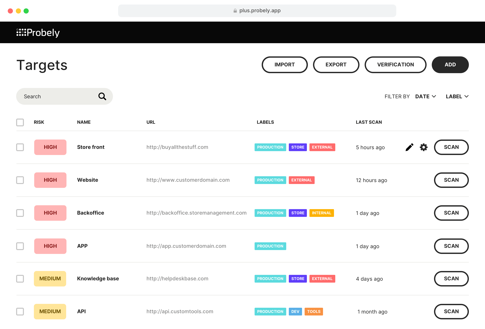

# Editions of Probely

## Standard (SMB) Edition

The standard edition of Probely is designed for growing companies that do not have an in-house cybersecurity team and rely on Development or DevOps teams to perform security testing.

The entire user experience of Probely is constructed around this specific use-case. We’ve built a product that is sleek and easy to use and allows you to start scanning within five minutes. Issues are exposed along with meticulous instructions on how to fix them.

Development and DevOps teams’ security testing becomes less reliant on security teams, more independent, and integrated into the SDLC.

## Enterprise Edition

Probely Enterprise is the top-tier edition of Probely, designed for enterprise companies that manage a large number of attack surfaces across web applications, APIs, and internal targets.

In addition to the features you might expect in an enterprise-level platform, such as roles and permissions or single sign-on, we also offer exclusive features. These include standalone API scanning, a separate agent to scan internal targets, a UI that is focused on managing the risks for a large number of targets, and a complete set of integrations with 3rd-party software.

We want you to automate security testing in the most efficient way. Integrating security testing into your development processes, from your CI/CD tool to your issue tracker, narrows the gap between development, security, and operations. It makes security an intrinsic part of your web application development life-cycle. And, it means you report on the security vulnerabilities that matter, free of false positives and with accurate instructions on how to fix them.

