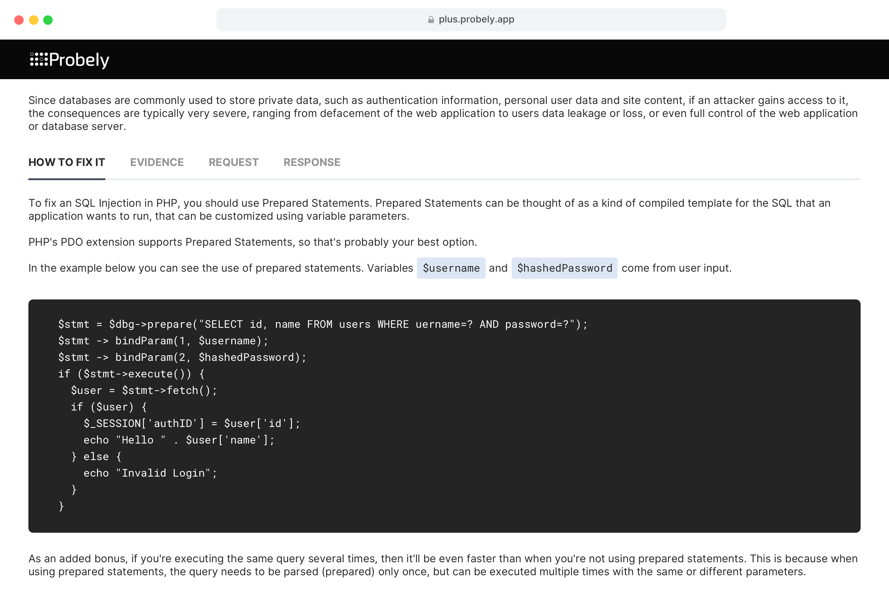
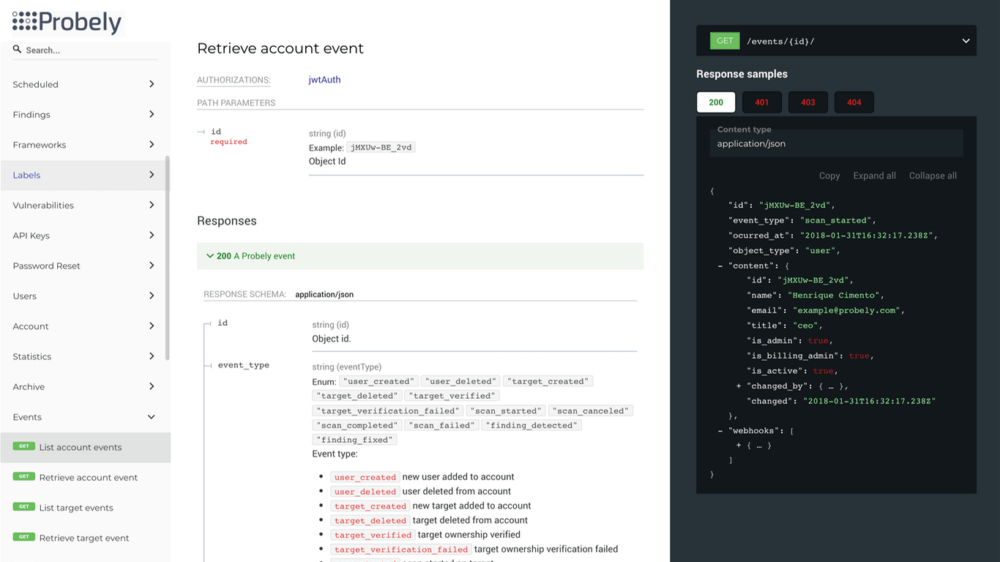

# What is Probely?
 
Probely is a DAST (_Dynamic Application Security Testing_) scanner, designed to ensure that your webpage becomes safer. Our product lets you extensively scan your web platform in search of any security vulnerabilities it might have.

Probely scans a wide realm of vulnerabilities, from XSS and SQL Injections to Missing Headers and Misconfigured Cookies. 
It will also advise you on how to fix it and show you where said vulnerabilities were found.

## Why do Devs need Probely?

Existing scanning tools are not typically intended for developers. With the explosion of web applications and agile development methodologies, developers must become more adept and independent in accurately assessing their web application and API security. 

Probely is intended to provide independence, meaning you can test the apps you’re designing earlier in the development process. Scans can be configured to run frequently and automatically – without the assistance of security professionals. This agility contributes to a faster, and consequently more affordable, development process, while improving your web applications’ overall security posture.

## Tailored Instructions

All scans begin by running a fingerprinting module, which detects all technologies in use, whether they’re out of date and whether they contain known vulnerabilities. Probely will then provide detailed instructions on how to fix the vulnerabilities based on the technologies found in your website applications and APIs.

## API-first Development Approach

Probely follows an API-first development approach. This means that every single feature of Probely is first available on the API and then added to the interface. If we don’t have the integration you need, or if you want to integrate Probely with custom software or workflows, you can always use our API. You can also register account-based or target-based web hooks so that your application is always notified of every Probely event.

## Integration with CI-CD Tools, Issue Trackers & Messaging Apps

Probely integrates with your preferred CI/CD tools, issue trackers, and messaging apps. If, for instance, your development team uses Jira to track issues and Jenkins as the CI/CD tool, you can seamlessly integrate Probely into this existing workflow. Automatically start scans within your CI/CD pipelines and view the vulnerabilities detected by Probely as new issues in Jira. Once the team fixes them and closes the Jira issues, Probely will automatically re-test the vulnerability and reopen the issue on Jira if necessary.

**It's like having a virtual specialist looking after your app!**

